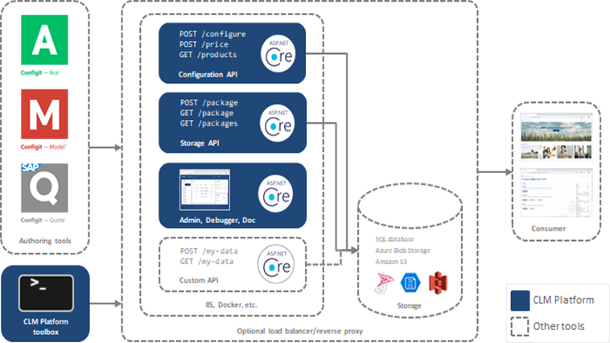

#Day1


# Course Introduction

<audio controls>
  <source src="./audio/ace-platform-intro.m4a" type="audio/mp3">
  <source src="myAudio.ogg" type="audio/ogg">
  <p>
    Your browser doesn't support HTML5 audio.
    Here is a <a href="./audio/ace-platform-intro.m4a">link to download the audio</a> instead.
  </p>
</audio>

[about-ace-platform](https://docs.configit.com/ace/admin/ace-platform/about-ace-platform)


<details>
<summary> 
#About the presenter
</summary>
<p>

#### yes, even hidden code blocks!

```python
print("hello world!")
```

</p>
</details>



<details>
<summary> 
# Architecture
</summary>

</details>


<details>
<summary> 
#VT Technology
</summary>


</details>


<iframe width="560" height="315" src="https://www.youtube.com/embed/tPPIGC58ih8" title="YouTube video player" frameborder="0" allow="accelerometer; autoplay; clipboard-write; encrypted-media; gyroscope; picture-in-picture" allowfullscreen></iframe>

<details>
<summary> 
#Day1 training
</summary>

<video width="320" height="240" controls>
  <source src="./video/ace2training.mp4" type="video/mp4">
Your browser does not support the video tag.
</video>


[](./video/ace2training.mp4 "Link Title")

</details>


# Hosting

[# Hosting](https://github.com/configit-samples/clm-hosting)

<a href="https://github.com/configit-samples/clm-hosting" target="_blank">Hosting!</a>


### Ordered

1. Overview
  1. topic 1
  2. topic 2
2. Installation
13. Item 3
  1. Item 3a
  1. Item 3b


